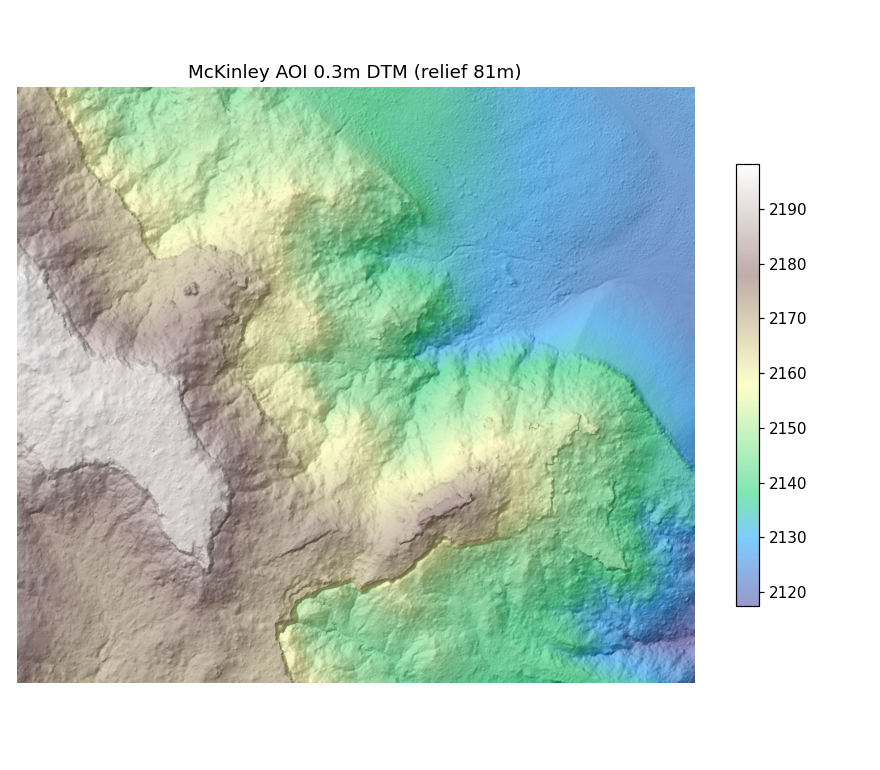

# mine-pointcloud-seg

**Label-Efficient Semantic Segmentation of Post-Mining LiDAR Point Clouds**

Self-supervised pre-training and geometric weak labels for segmenting open-pit mine and
terrain LiDAR — targeting the three pain points of point-cloud methods on mine sites:
annotation cost, weak cross-site generalisation, and missing uncertainty.

### ▶ Live interactive demo — https://harry33t.github.io/mine-pointcloud-seg/

Orbit a real open-pit mine in the browser and switch the colouring between aerial RGB,
geometric segmentation, and relief; switch to the aerial benchmark to compare model
prediction, ground truth, and per-point uncertainty.



## What it shows

| | Result |
|---|---|
| **Label efficiency** | per-class IoU vs label budget — dominant classes saturate from 1% of labels; rare classes only emerge near full supervision |
| **Self-supervised pre-training** | in-domain masked-scene-contrast pre-training on unlabelled aerial point clouds lifts mIoU by ~4–5 points over random init |
| **Calibrated uncertainty** | temperature scaling cuts expected calibration error from 0.021 → 0.007; per-point entropy drives the viewer |
| **Cross-site transfer (LOCO)** | leave-one-site-out across four regions → ~6 mIoU generalisation gap, smallest from the data-richest site |
| **Real mine** | geometric weak labels segment the McKinley open-pit (0.3 m LiDAR) into floor / slope / highwall with no manual annotation |

Result figures are in [`figs/`](figs/).

## Run the viewer locally

```bash
cd web
npm install
npm run dev      # http://localhost:5173
```

The scene data and figures are generated by the Python pipeline (`src/mpcseg`) and
exported with `mpcseg.data.process_dem` / `mpcseg.viz.export_web`.

## Data (open)

- **FRACTAL** aerial-LiDAR benchmark — IGN France ([IGNF/FRACTAL](https://huggingface.co/datasets/IGNF/FRACTAL)).
- **McKinley Mine, NM** — airborne LiDAR + orthophoto, U.S. OSMRE / Surdex, via
  [OpenTopography](https://doi.org/10.5069/G9BZ6486) (CC BY 4.0).

## Stack

PyTorch · Pointcept (PTv3 / SpUNet) · masked scene contrast (in-domain SSL) ·
GDAL · Open3D · jakteristics · React + TypeScript + three.js (viewer).

## License

Code: MIT. Data: per the original dataset licences (McKinley Mine CC BY 4.0).
